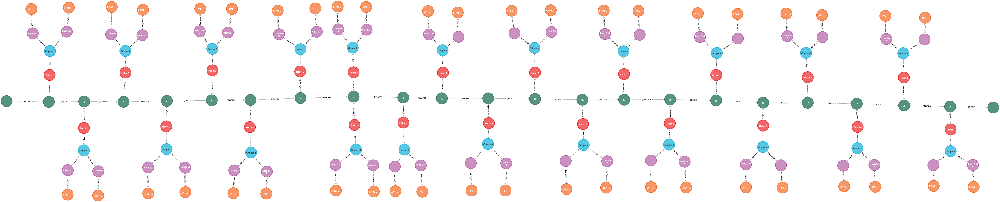
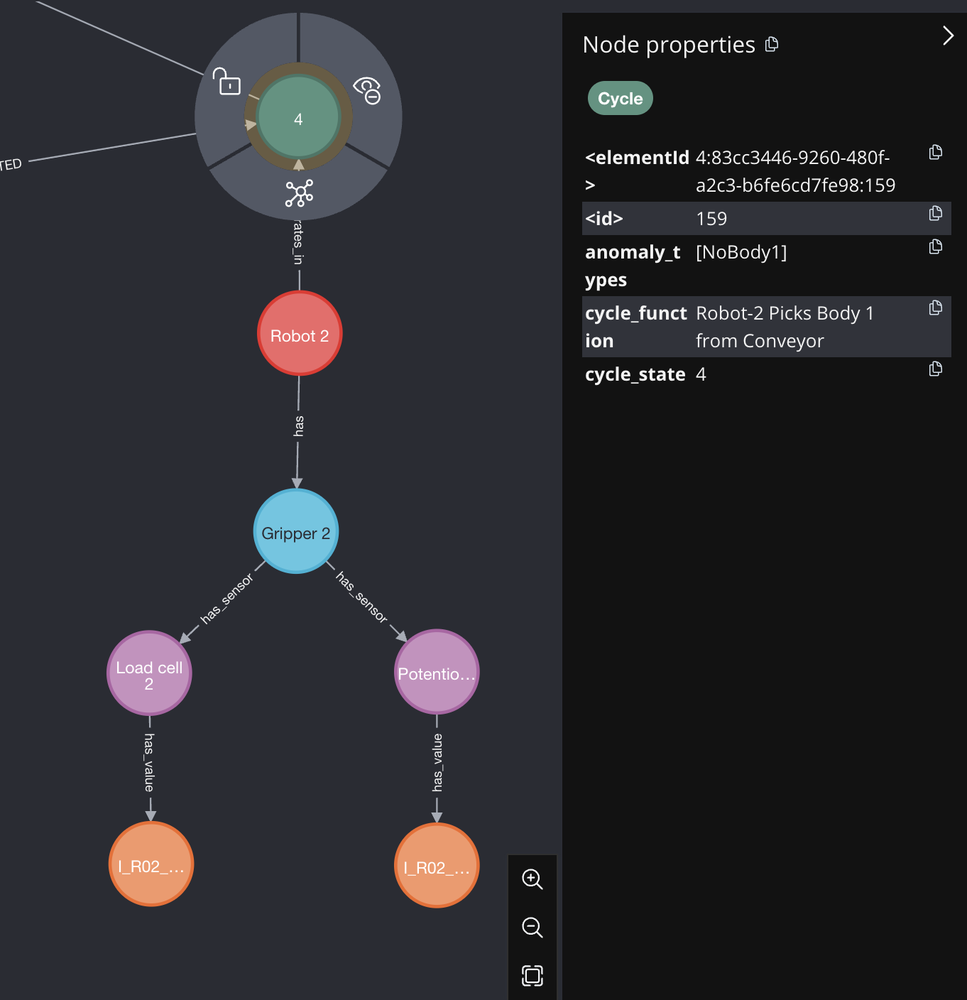
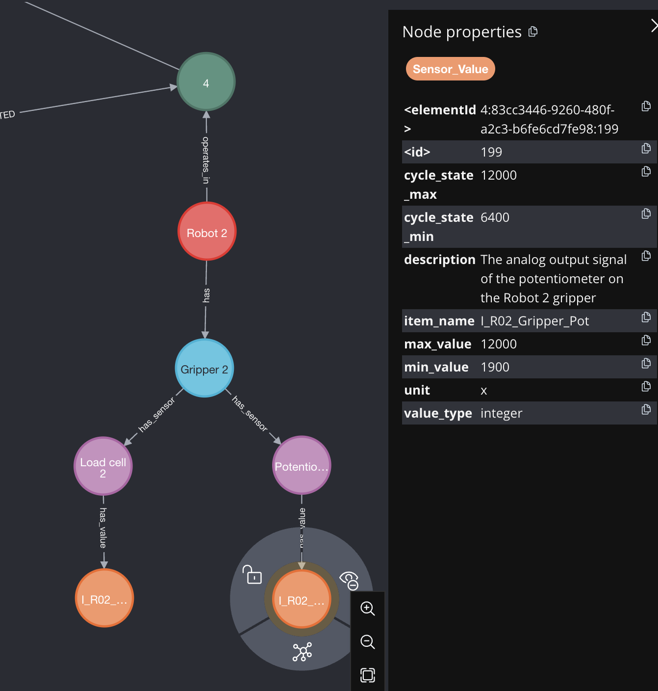

## Process Ontology for Future Factories Assembly Cell
In this repository, we propose Dynamic Process Ontology (DPO) designed and implemented for (rocket assembly testbed)[] where four robots are involved to assembly four rocket body parts. During this assembly process, several anomalies could happen which can be detected or predicted using several machine or deep learning models. The Dynamic Process Ontology aids us in analysing these anomalies further by answering questions such as (i) which sensor produced anomalous values and what are the expected values of this sensor? (ii) to which robot the anomalous sensor is attached to? (iii) what was the function of the robot when the anomaly happened? (iv) till which stage in the assembly line the process ran successfully?

Unlike conventional ontologies that consist of interlinked web of concepts, the proposed process ontology captures temporal attribute of assembly line. The ontology is built based on the 21 cycle states which represents a step-by-step stage in the assembly process. Each cycle state consists of (i) respective robot that is involved in the cycle state along with its function specific to this cycle state in addition to other properties (ii) corresponding sensors and their expected normal range as per the cycle state along with other properties (iii) expected anomalies that can happen in a given cycle state. The dynamic nature of the ontology allows updating the properties of entities if the sensors or equipment need to be calibrated for each experiment. A snapshot of the proposed Dynamic Process Ontology can be found below.

 
 

  <figure style="display: inline-block; margin: 0;">
    
    <figcaption style="text-align: center; margin-top: 10px;">An overview of the ontology where the green nodes are cycle states, red nodes are robots, purple nodes are sensors of respective robots.</figcaption>
  </figure>

 
 

  <figure style="display: inline-block; margin: 0;">
    
    <figcaption style="text-align: center; margin-top: 10px;">A Snapshot of cycle state 4 and its properties. It consists of function of the robot in this cycle state along with possible anomaly types.</figcaption>
  </figure>

 
 

  <figure style="display: inline-block; margin: 0;">
    
    <figcaption style="text-align: center; margin-top: 10px;">Properties of the sensor potentiometer of Robot-2 that is involved in cycle state 4. The minimum and maximum values can be dynamically updated as per the calibration of experimentation set up. The values of other properties can also be changed as required.</figcaption>
  </figure>

 
 

### Steps to run
* Download the most recent version of docker as per your OS from here - https://docs.docker.com/desktop/release-notes/ and install the docker on your system
* In the project folder which is a cloned version of this git repository, change the $USER and $UID in .env file. To find out the values `echo $USER` and `echo $UID` from your command terminal
* Create two folders insider the project folder 
* * A folder to save the graph database (graph_data)
* * A folder where the original raw data files are stored (This doesn't exist for now. So create an empty folder named raw_files)
* Mention these paths in the docker-compose.yml file. Mention full path.
* * `<path to raw_folder>:/import`
* * `<path to graph_data>:/data`
* Download the plugin [apoc-5.16.0-extended.jar](https://drive.google.com/file/d/12iVJVKnC4H-dYCx_-vhaKJwk9zzpXWzy/view?usp=sharing) and put it into a folder named `plugins` mention full path in the docker-compose file. Better to put this somewhere outside the project folder. 
* * `<path to plugins>:/var/lib/neo4j/plugins`
* Command to stand up the docker container `docker compose up --build`
* Access the notebook and neo4j from ports `https://localhost:8888` and `https://localhost:7474` respectively. This is just a step if you need to visualize something. So it can be skipped.
* Username and password for neo4j is in .env file
* Password for Jupyterlab is in .env file
* If you want to execute the python scripts, check the isntruction under that section
* Command to get the docker container down `docker compose down -v`
* NOTE: Currently, jupyterlab is commented out in the docker-compose.yml. Uncomment it before starting the docker is needed

### Python Scripts
* The python files are present in the folder python_files
* Create a virtual environment using `python3 -m venv <env_name> `. Install the required packages using `pip install -r requirements.txt`
* Activate the virutal environment before you have to run the script.
* The script main.py has the template to input your data and get the explanation behind anomalies
* The sample input data files are in mfg-data/anomaly_data. Make sure the column names are exactly the same if you plan on using a new file.
* The sample output files are in mfg-data/results

### ERRORS
* if `docker command not found` after the installation, add it to your path. For mac, ` export PATH="$PATH:/Applications/Docker.app/Contents/Resources/bin/" `. Link - https://stackoverflow.com/questions/64009138/docker-command-not-found-when-running-on-mac 

* if `OSError:No space left on deivce` while running docker compose, do `docker system prune -af`. Link - https://stackoverflow.com/questions/44664900/oserror-errno-28-no-space-left-on-device-docker-but-i-have-space 